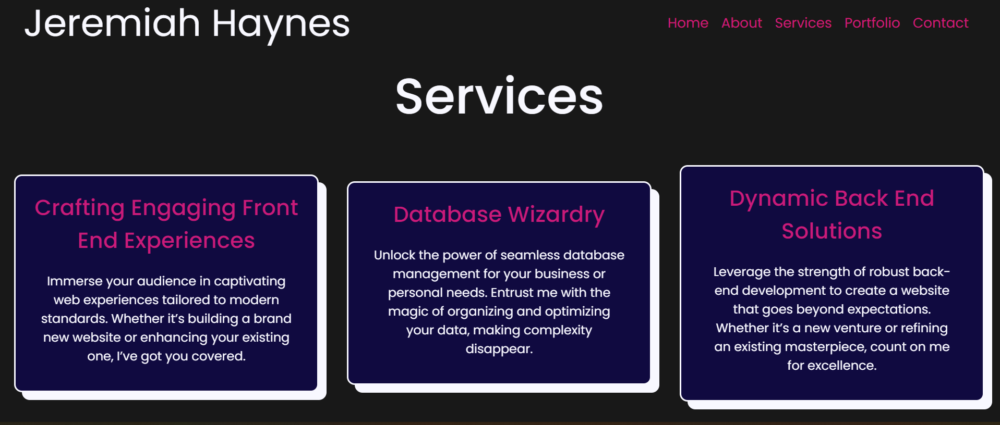

# React Portfolio

<p align='center'>

</p>


## Overview

Welcome to my React Portfolio, a showcase of my skills and projects. Built using popular React libraries and tools, this portfolio provides a dynamic and interactive way to explore my work.


## Technologies Used

- [React](https://react.dev/): React is a JavaScript library for building user interfaces. It enables the creation of reusable UI components, making it easier to manage and update complex user interfaces.
- [React DOM](https://react.dev/reference/react-dom): Provides the DOM-specific methods necessary for rendering React components. It works in conjunction with React to update and manage the DOM efficiently.
- [React Icons](https://react-icons.github.io/react-icons/): A library that provides a collection of popular icons for use in React applications. It allows you to easily integrate icons from various icon libraries, enhancing the visual appeal of your components.
- [React Scripts](https://github.com/facebook/create-react-app): A set of scripts and configurations used by Create React App, a popular tool for quickly setting up and bootstrapping React applications. It abstracts complex configurations, making it easier to start a new React project.
- [React Scroll](https://github.com/fisshy/react-scroll): React component that provides smooth scrolling behavior when navigating between different sections of a webpage. It enhances the user experience by adding a visually pleasing transition effect.
- [Web Vitals](https://github.com/GoogleChrome/web-vitals#readme): A library that helps measure and report essential web performance metrics. It provides insights into key performance indicators like loading times, interactivity, and visual stability, helping developers optimize their websites for a better user experience.
Sass:
- [Sass](https://sass-lang.com/documentation/): Sass (Syntactically Awesome Stylesheets) is a preprocessor scripting language that is interpreted or compiled into Cascading Style Sheets (CSS). It adds features like variables, nesting, and mixins to make styling more maintainable and efficient.


## Installation

Follow these steps to setup the project locally:

1. Clone the repository to your local machine: 
``` bash
git clone https://github.com/dsatpm/REACT-portfolio.git
```

2. Navigate to the project directory: 
``` bash
cd react-portfolio
```

3. Install dependencies:
``` bash
npm install
```

4. Run the development server:
``` bash
npm start
```
The portfolio will run on `http://localhost/3000/` in your browser


## Features

### Responsive Design
The portfolio is designed to be fully responsive, ensuring a seamless experience across various devices. (Still under construction)
### Project Showcase
Highlight your projects, skills, and experiences with an interactive and visually appealing layout.
### Smooth Scroll
Implement smooth scrolling between different sections of the portfolio for a modern user experience.


## Usage

Feel free to use this portfolio template for showcasing your own work. Customize the content, add your projects, and personalize it according to your preferences.


## Contributing

Contributions and feedback are welcome! If you find any issues or have suggestions for improvements, please create an issue or submit a pull request.


## License

This project licensed under the [MIT License]


## Connect with me

- [jeremiah-haynes.com](https://jeremiah-haynes.com)
- [Github](https://github.com/dsatpm)
- [LinkedIn](https://linkedin.com/in/jeremiah-j-haynes)